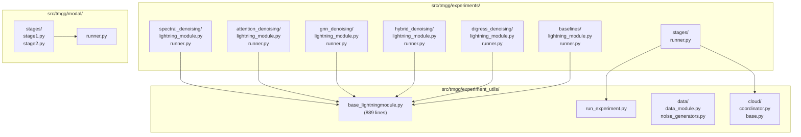
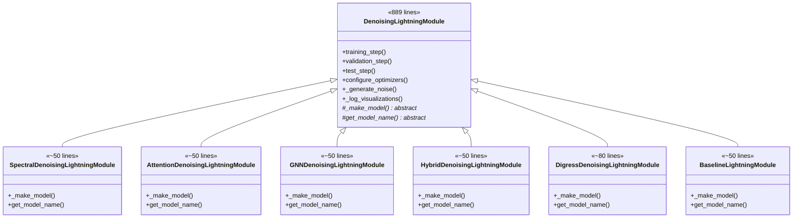
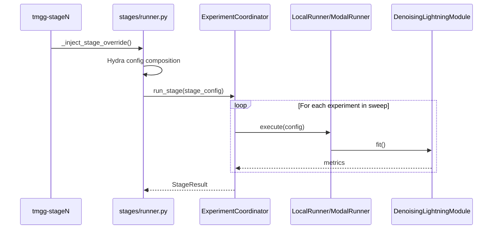

# Architecture: Code Sharing Analysis

[← Back to Overview](./00_overview.md)

## Module Structure

The codebase organizes experiments into three main areas, with shared utilities minimizing code duplication.



## Inheritance Hierarchy

All experiment types inherit from a single `DenoisingLightningModule` base class, which encapsulates 80% of training logic.



## Runner Code Analysis

Each experiment folder contains a `runner.py` that follows an identical pattern of ~35 lines:

```python
# Typical runner.py structure (all experiments)
@hydra.main(config_path=CONFIG_PATH, config_name="base_config_XXX")
def main(config):
    return run_experiment(config)
```

This minimal runner code demonstrates effective code reuse: the centralized `run_experiment()` function handles all execution logic, while Hydra composition selects the appropriate model and data configurations.

## Code Sharing Assessment

| Component | Lines | Shared? | Notes |
|-----------|-------|---------|-------|
| Base Lightning module | 889 | Yes | Single source of truth for training |
| Experiment Lightning modules | ~50 each | Partially | Only `_make_model()` differs |
| Runner files | ~35 each | Template | Identical structure, different config names |
| Data modules | 400+ | Yes | Single `GraphDataModule` handles all datasets |
| Noise generators | 200+ | Yes | Unified interface for all noise types |
| Metrics/visualization | 300+ | Yes | Centralized in experiment_utils |

**Code duplication ratio**: Approximately 5% — the codebase effectively centralizes shared logic.

## Stage Execution Flow



## Key Strengths

1. **Single source of truth**: `DenoisingLightningModule` handles training, validation, checkpointing, and visualization
2. **Minimal boilerplate**: Experiment-specific code is limited to model instantiation (~50 lines)
3. **Unified data loading**: `GraphDataModule` supports SBM, ER, trees, PyG datasets through configuration
4. **Cloud abstraction**: `CloudRunner` interface allows local/Modal/Ray execution without code changes

## Areas for Improvement

The `_make_model()` method in each Lightning module contains similar conditional logic:

```python
if model_type == "linear_pe":
    return LinearPEModel(...)
elif model_type == "filter_bank":
    return FilterBankModel(...)
```

A registry or factory pattern would reduce this repeated structure as more architectures are added.

---

[Next: Config Sharing →](./02_config_sharing.md)
