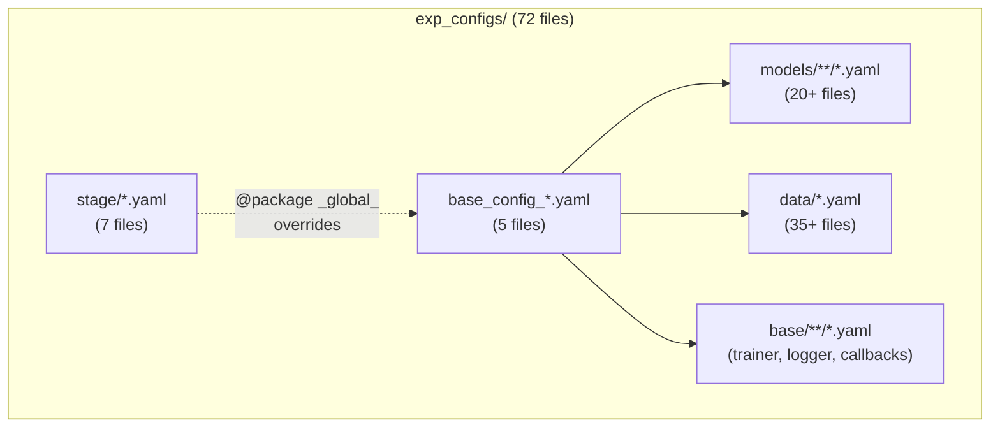
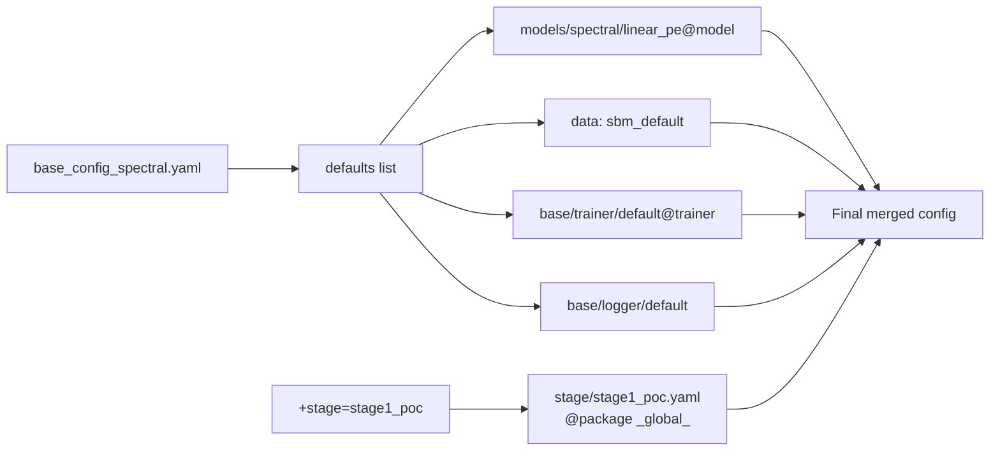
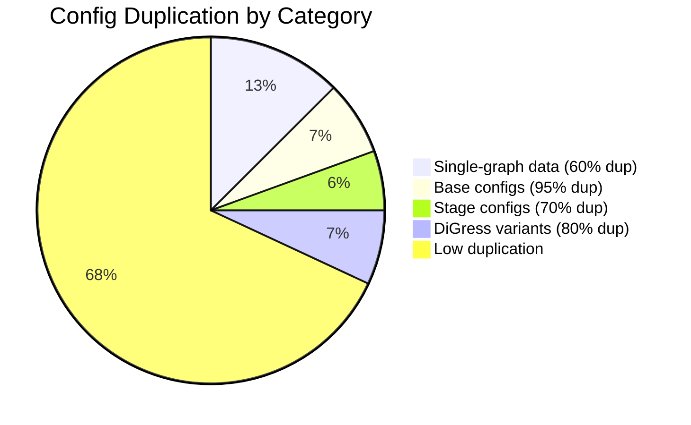

# Config Sharing Analysis

[← Back to Overview](./00_overview.md) | [← Architecture](./01_architecture.md)

## Configuration Structure

The project uses Hydra for configuration management with 72 YAML files organized hierarchically.



## Hydra Composition Flow

When running `tmgg-stage1 sweep=true`, Hydra composes configs in this order:



**Key mechanism**: Stage configs use `@package _global_` to override the parent config directly, allowing them to change optimizer settings and data defaults without modifying base configs.

## Config Files by Category

### Base Configs (5 files)

| File | Model Default | Data Default | Unique Content |
|------|---------------|--------------|----------------|
| `base_config_spectral.yaml` | linear_pe | sbm_default | ~5% unique |
| `base_config_attention.yaml` | multi_layer_attention | sbm_default | ~5% unique |
| `base_config_gnn.yaml` | standard_gnn | sbm_default | ~5% unique |
| `base_config_hybrid.yaml` | hybrid_with_transformer | sbm_default | ~5% unique |
| `base_config_digress.yaml` | digress_transformer | sbm_default | ~5% unique |

**Problem**: These 5 files share 95% identical content (paths, logging, hydra output dirs, sweep settings). Only the model default differs.

### Stage Configs (7 files)

| File | Default Data | Optimizer | Key Difference |
|------|--------------|-----------|----------------|
| `stage1_poc.yaml` | sbm_single_graph | adam, wd=0 | Original POC settings |
| `stage1_sanity.yaml` | sbm_single_graph | adam, wd=0 | fixed_noise_seed=42 |
| `stage1_5_crossdata.yaml` | er_single_graph | adamw, wd=1e-12 | 9 datasets |
| `stage2_validation.yaml` | er_single_graph | adamw, wd=1e-12 | same_graph_all_splits=false |
| `stage3_diversity.yaml` | — | — | Deferred |
| `stage4_benchmarks.yaml` | — | — | Deferred |
| `stage5_full.yaml` | — | — | Deferred |

**Problem**: stage1_5 and stage2 differ only by `same_graph_all_splits` and `val_test_seed` settings, yet are fully separate files.

### Single-Graph Data Configs (9 files)

These configs for the single-graph protocol share extensive boilerplate:

| File | graph_type | Unique Parameters |
|------|------------|-------------------|
| `sbm_single_graph.yaml` | sbm | p_intra, p_inter, num_blocks |
| `er_single_graph.yaml` | erdos_renyi | p (edge probability) |
| `regular_single_graph.yaml` | regular | degree |
| `tree_single_graph.yaml` | tree | — |
| `roc_single_graph.yaml` | ring_of_cliques | num_cliques, clique_size |
| `lfr_single_graph.yaml` | lfr | mu, min_degree, max_degree |
| `pyg_qm9_single_graph.yaml` | pyg | dataset_name |
| `pyg_enzymes_single_graph.yaml` | pyg | dataset_name |
| `pyg_proteins_single_graph.yaml` | pyg | dataset_name |

**Shared content across all 9 files** (identical):
```yaml
_target_: tmgg.experiment_utils.data.SingleGraphDataModule
same_graph_all_splits: true
train_seed: 42
val_test_seed: 123
num_train_samples: 1000
num_val_samples: 100
num_test_samples: 100
batch_size: 16
num_workers: 4
noise_levels: [0.1]
noise_type: digress
```

This represents ~60% of each config file. A `single_graph_base.yaml` would eliminate this repetition.

## Duplication Hotspots



### DiGress Variant Explosion

The DiGress model has 5 config variants that form a 2×2 matrix plus adjacency variants:

| Config | Learning Rate | Optimizer | Output |
|--------|--------------|-----------|--------|
| `digress_sbm_small.yaml` | 0.0002 | amsgrad | edge |
| `digress_sbm_small_highlr.yaml` | 0.01 | adam | edge |
| `digress_sbm_small_adj.yaml` | 0.0002 | amsgrad | adjacency |
| `digress_sbm_small_highlr_adj.yaml` | 0.01 | adam | adjacency |
| `digress_transformer.yaml` | 0.0002 | amsgrad | edge |

A cleaner approach would use a single `digress_base.yaml` with parameter overrides.

## Config Precedence Issues

The same parameter appears in multiple locations with unclear precedence:

```
learning_rate:
├── base_config_spectral.yaml: 1e-3        (default)
├── stage/stage1_poc.yaml: 1e-2            (stage override)
├── models/spectral/linear_pe.yaml: ${...}  (interpolation)
└── models/digress/digress_sbm_small.yaml: 0.0002  (model-specific)
```

Hydra resolves later entries over earlier ones, but this scattered definition makes it difficult to track which value is active for a given experiment.

## Optimal vs. Current State

| Aspect | Current | Optimal | Gap |
|--------|---------|---------|-----|
| Base config files | 5 nearly identical | 1 base + 5 minimal overrides | High |
| Single-graph data | 9 with 60% duplication | 1 base + 9 minimal | High |
| Stage configs | 4 with 70% overlap | 1 base + stage-specific | Medium |
| DiGress variants | 5 separate files | 1 base + runtime params | Medium |
| Optimizer settings | Scattered | Single source of truth | High |

---

[Next: Stage Comparison →](./03_stage_comparison.md)
