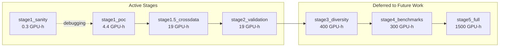
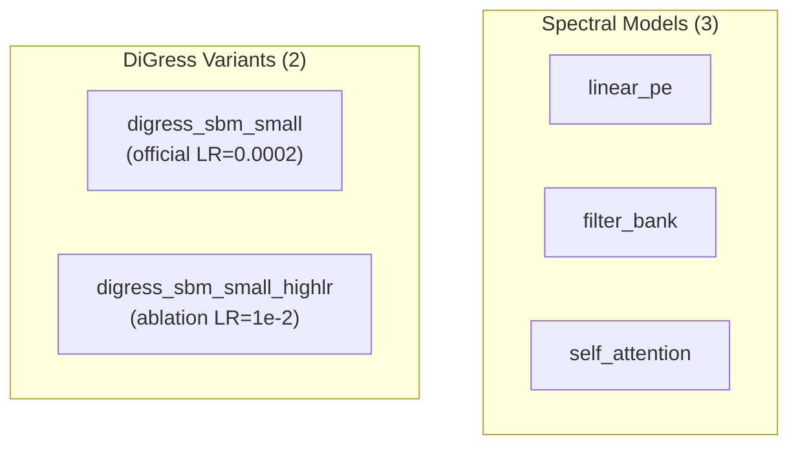
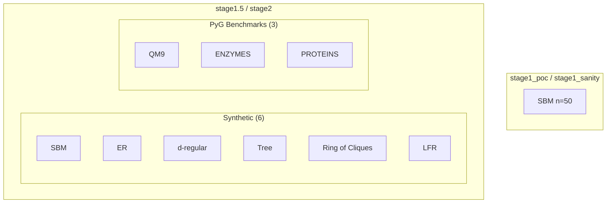

# Stage Comparison

[← Back to Overview](./00_overview.md) | [← Config Sharing](./02_config_sharing.md)

## Stage Progression



## Full Comparison Matrix

| Parameter | stage1_poc | stage1_sanity | stage1.5 | stage2 | stage3+ |
|-----------|------------|---------------|----------|--------|---------|
| **Budget** | 4.4 GPU-h | 0.3 GPU-h | 19 GPU-h | 19 GPU-h | 400+ GPU-h |
| **CLI** | `tmgg-stage1` | `tmgg-stage1-sanity` | `tmgg-stage1-5` | `tmgg-stage2` | — |
| **Goal** | POC validation | Memorization test | Cross-dataset | Cross-graph generalization | Diversity |
| **Default data** | sbm_single_graph | sbm_single_graph | er_single_graph | er_single_graph | — |
| **Optimizer** | adam | adam | adamw | adamw | — |
| **learning_rate** | 1e-2 | 1e-2 | 1e-2 | 1e-2 | — |
| **weight_decay** | 0.0 | 0.0 | 1e-12 | 1e-12 | — |
| **amsgrad** | — | — | true | true | — |
| **Scheduler** | none | none | none | none | — |
| **model.k** | 50 | 50 | 50 | 50 | — |
| **same_graph_all_splits** | true | true | true | **false** | — |
| **val_test_seed** | (default) | (default) | (default) | **100** | — |
| **fixed_noise_seed** | null | **42** | null | null | — |
| **Architectures** | 5 | 5 | 5 | 5 | — |
| **Datasets** | 1 (SBM) | 1 (SBM) | 9 | 9 | 11+ |
| **Noise levels** | 5 | 1 | 3 | 3 | — |
| **num_trials** | 4 | 4 | 4 | 4 | 8-20 |
| **seeds** | [1,2,3] | [1,2,3] | [1,2,3] | [1,2,3] | [1..5] |

## Key Differentiators

### stage1_poc vs stage1.5/stage2

The most significant difference is the optimizer configuration:

| Setting | stage1_poc | stage1.5/stage2 |
|---------|------------|-----------------|
| optimizer_type | adam | adamw |
| weight_decay | 0.0 | 1e-12 |
| amsgrad | (not set) | true |

This means results from stage1 cannot be directly compared to stage1.5/stage2 without accounting for optimizer differences. The optimizer change was made between stages without documenting the rationale.

### stage1.5 vs stage2

These two stages are nearly identical except for the cross-graph validation protocol:

```yaml
# stage1.5: same graph for train/val/test
same_graph_all_splits: true

# stage2: different graphs for val/test
same_graph_all_splits: false
val_test_seed: 100  # explicit seed for reproducibility
```

The near-duplication suggests these could be a single stage with a `cross_graph: bool` parameter.

### stage1_sanity

A diagnostic stage that tests model capacity by fixing the noise seed:

```yaml
fixed_noise_seed: 42  # Same noise every step = memorization task
```

If a model achieves <99% accuracy on this stage, something fundamental is broken (gradient flow, optimizer, architecture capacity).

## Sweep Configuration Comparison

| Stage | learning_rate sweep | noise_levels sweep | datasets | Total experiments |
|-------|---------------------|-------------------|----------|-------------------|
| stage1_poc | [1e-3, 1e-2] | 5 levels | 1 | 5×2×5×4×3 = 600 |
| stage1_sanity | (fixed 1e-2) | 1 level | 1 | 5×1×1×4×3 = 60 |
| stage1.5 | (fixed 1e-2) | 3 levels | 9 | 5×9×3×4×3 = 1620 |
| stage2 | (fixed 1e-2) | 3 levels | 9 | 5×9×3×4×3 = 1620 |

Note: stage1_poc is the only stage that sweeps learning_rate. Other stages fix it at 1e-2, which may miss optimal settings for different architectures (especially DiGress with its official LR of 0.0002).

## Architecture Coverage

All active stages test the same 5 architectures:



The DiGress variants exist to test whether its architecture benefits from higher learning rates when trained in the same regime as spectral models. This is a reasonable ablation, but the naming could be clearer.

## Dataset Coverage by Stage



## Comparability Assessment

| Comparison | Comparable? | Blocking Issue |
|------------|-------------|----------------|
| stage1 vs stage1_sanity | Yes | Same config except fixed_noise_seed |
| stage1 vs stage1.5 | **No** | Different optimizer (adam vs adamw) |
| stage1 vs stage2 | **No** | Different optimizer + cross-graph protocol |
| stage1.5 vs stage2 | **Partially** | Same optimizer, but different validation protocol |

To enable fair comparisons across all stages, the optimizer configuration should be unified or explicitly documented as an experimental variable.

---

[Next: Bugs and Issues →](./04_bugs_and_issues.md)
