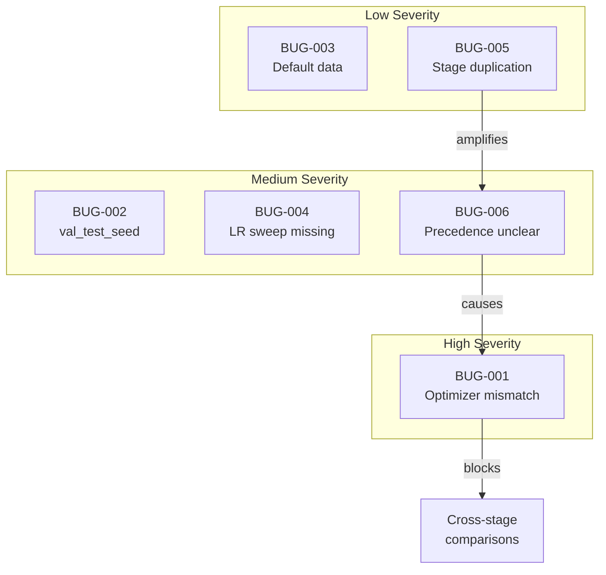

# Bugs and Issues

[← Back to Overview](./00_overview.md) | [← Stage Comparison](./03_stage_comparison.md)

## Issue Summary

| ID | Severity | Type | Description |
|----|----------|------|-------------|
| BUG-001 | High | Inconsistency | Optimizer mismatch between stages |
| BUG-002 | Medium | Inconsistency | val_test_seed mismatch |
| BUG-003 | Low | Inconsistency | Default data config differs between stages |
| BUG-004 | Medium | Missing | learning_rate sweep absent from stage1.5/2 |
| BUG-005 | Low | Duplication | stage1.5 and stage2 near-duplicates |
| BUG-006 | Medium | Unclear | Scattered optimizer precedence |

---

## BUG-001: Optimizer Mismatch Between Stages

**Severity**: High
**Type**: Inconsistency
**Impact**: Results from stage1 cannot be directly compared to stage1.5/2

### Description

Stage configurations use different optimizer settings without documented rationale:

```yaml
# stage1_poc.yaml
learning_rate: 1e-2
weight_decay: 0.0
optimizer_type: adam

# stage1_5_crossdata.yaml / stage2_validation.yaml
learning_rate: 1e-2
weight_decay: 1e-12
optimizer_type: adamw
amsgrad: true
```

### Root Cause

The optimizer was changed between stage1 and stage1.5 development, likely to improve training stability. However, this change was not backported to stage1 or documented.

### Files Affected

- [`src/tmgg/exp_configs/stage/stage1_poc.yaml:22-24`](../src/tmgg/exp_configs/stage/stage1_poc.yaml)
- [`src/tmgg/exp_configs/stage/stage1_5_crossdata.yaml:21-24`](../src/tmgg/exp_configs/stage/stage1_5_crossdata.yaml)
- [`src/tmgg/exp_configs/stage/stage2_validation.yaml:29-32`](../src/tmgg/exp_configs/stage/stage2_validation.yaml)

### Recommendation

Either:
1. Unify all stages to use adamw with weight_decay=1e-12 (preferred for consistency)
2. Document the optimizer choice as an explicit experimental variable in the stage design

---

## BUG-002: val_test_seed Mismatch

**Severity**: Medium
**Type**: Inconsistency
**Impact**: Potential reproducibility issues when running stage2 with different data configs

### Description

Data configs define `val_test_seed: 123`, but stage2 overrides it to `100`:

```yaml
# data/er_single_graph.yaml
val_test_seed: 123

# stage/stage2_validation.yaml
data:
  same_graph_all_splits: false
  val_test_seed: 100  # Overrides the data config default
```

### Root Cause

Stage2 was developed with a different seed for val/test graph generation, but the data configs retain the old default. This creates confusion about which seed is actually used.

### Files Affected

- [`src/tmgg/exp_configs/data/er_single_graph.yaml:19`](../src/tmgg/exp_configs/data/er_single_graph.yaml)
- [`src/tmgg/exp_configs/stage/stage2_validation.yaml:19`](../src/tmgg/exp_configs/stage/stage2_validation.yaml)
- All 9 `*_single_graph.yaml` files contain `val_test_seed: 123`

### Recommendation

Choose a single default and use it consistently. If stage2 requires a different seed for experimental reasons, document why.

---

## BUG-003: Default Data Config Differs Between Stages

**Severity**: Low
**Type**: Inconsistency
**Impact**: Minor confusion about which dataset is "default" for experiments

### Description

Stage configs use different default datasets:

```yaml
# stage1_poc.yaml, stage1_sanity.yaml
defaults:
  - override /data: sbm_single_graph

# stage1_5_crossdata.yaml, stage2_validation.yaml
defaults:
  - override /data: er_single_graph
```

### Root Cause

Stage1 was developed with SBM as the primary test case. When stage1.5 expanded to multiple datasets, ER was chosen as the new default (alphabetically first in the synthetic list).

### Files Affected

- [`src/tmgg/exp_configs/stage/stage1_poc.yaml:13`](../src/tmgg/exp_configs/stage/stage1_poc.yaml)
- [`src/tmgg/exp_configs/stage/stage1_5_crossdata.yaml:11`](../src/tmgg/exp_configs/stage/stage1_5_crossdata.yaml)

### Recommendation

Not critical to fix, but could use SBM as the consistent default since it's the canonical test case from the experimental design.

---

## BUG-004: learning_rate Sweep Missing from stage1.5/2

**Severity**: Medium
**Type**: Missing
**Impact**: May miss optimal learning rates for different architectures

### Description

Stage1 sweeps learning rate, but stage1.5 and stage2 fix it:

```yaml
# stage1_poc.yaml
_sweep_config:
  hyperparameter_space:
    learning_rate: [1e-3, 1e-2]  # Sweeps LR
    noise_levels: [...]

# stage1_5_crossdata.yaml / stage2_validation.yaml
_sweep_config:
  hyperparameter_space:
    noise_levels: [...]  # No learning_rate sweep
```

### Root Cause

After stage1 determined that 1e-2 worked well for spectral models, later stages fixed LR to reduce experiment count. However, this may not be optimal for all architectures, especially DiGress which was designed for LR=0.0002.

### Impact

The DiGress comparison includes a `digress_sbm_small_highlr` variant to test high LR, but fixing LR in the sweep means the base DiGress model always uses its own lower LR (from its model config). This creates an implicit interaction between stage config and model config that's not immediately obvious.

### Files Affected

- [`src/tmgg/exp_configs/stage/stage1_poc.yaml:47`](../src/tmgg/exp_configs/stage/stage1_poc.yaml)
- [`src/tmgg/exp_configs/stage/stage1_5_crossdata.yaml:58-62`](../src/tmgg/exp_configs/stage/stage1_5_crossdata.yaml)

### Recommendation

Consider adding a minimal LR sweep to stage1.5/2, or document that LR is fixed based on stage1 findings.

---

## BUG-005: stage1.5 and stage2 Near-Duplicates

**Severity**: Low
**Type**: Duplication
**Impact**: Maintenance burden, potential for configs to drift

### Description

Stage1.5 and stage2 configs are 95% identical, differing only in:

```yaml
# Only differences between stage1_5_crossdata.yaml and stage2_validation.yaml:

# stage1.5: (implicit from data config)
# same_graph_all_splits: true  # Uses same graph for train/val/test

# stage2:
data:
  same_graph_all_splits: false
  val_test_seed: 100
```

### Root Cause

Stage2 was created by copying stage1.5 and adding the cross-graph validation protocol. No refactoring to extract common settings.

### Files Affected

- [`src/tmgg/exp_configs/stage/stage1_5_crossdata.yaml`](../src/tmgg/exp_configs/stage/stage1_5_crossdata.yaml) — 69 lines
- [`src/tmgg/exp_configs/stage/stage2_validation.yaml`](../src/tmgg/exp_configs/stage/stage2_validation.yaml) — 77 lines

### Recommendation

Either:
1. Merge into a single stage with a `cross_graph: bool` parameter
2. Extract shared settings into a `stage_crossdata_base.yaml` that both inherit from

---

## BUG-006: Scattered Optimizer Precedence

**Severity**: Medium
**Type**: Unclear
**Impact**: Difficult to determine which optimizer settings are active for a given run

### Description

Optimizer settings appear in multiple locations:

```
learning_rate defined in:
├── base_config_spectral.yaml:20      → 1e-3 (base default)
├── stage/stage1_poc.yaml:22          → 1e-2 (stage override)
├── models/spectral/linear_pe.yaml    → ${learning_rate} (interpolation from parent)
└── models/digress/digress_sbm_small.yaml → 0.0002 (model-specific)
```

Hydra resolves these via config composition, with later entries overriding earlier ones. The precedence is:

```
model config > stage config > base config
```

But this is not documented, and the interaction between model-specific LR (DiGress) and stage LR is not explicit.

### Root Cause

Organic growth of configuration without establishing clear ownership of optimizer settings.

### Files Affected

- All `base_config_*.yaml` files
- All `stage/*.yaml` files
- Several `models/**/*.yaml` files

### Recommendation

Establish a clear rule: optimizer settings live in stage configs, and model configs use interpolation. Document this in a config README.

---

## Issue Visualization



---

[Next: Recommendations →](./05_recommendations.md)
