# Recommendations

[← Back to Overview](./00_overview.md) | [← Bugs and Issues](./04_bugs_and_issues.md)

## Priority Matrix

| Recommendation | Effort | Impact | Priority |
|----------------|--------|--------|----------|
| R1: Unify optimizer settings | Low | High | **Critical** |
| R2: Extract single_graph_base.yaml | Medium | Medium | High |
| R3: Merge stage1.5/stage2 | Low | Medium | High |
| R4: Document config precedence | Low | Medium | Medium |
| R5: Consolidate base configs | Medium | Low | Low |
| R6: Add model factory registry | Medium | Low | Low |

---

## R1: Unify Optimizer Settings Across Stages

**Priority**: Critical
**Effort**: Low (config changes only)
**Addresses**: BUG-001, BUG-006

### Current State

Stage1 uses adam with no weight decay; stage1.5/2 use adamw with amsgrad.

### Proposed Change

Update stage1_poc.yaml to match stage1.5/2:

```yaml
# stage1_poc.yaml - proposed change
learning_rate: 1e-2
weight_decay: 1e-12  # Changed from 0.0
optimizer_type: adamw  # Changed from adam
amsgrad: true  # Added
```

### Implementation

```bash
# Files to modify:
src/tmgg/exp_configs/stage/stage1_poc.yaml
src/tmgg/exp_configs/stage/stage1_sanity.yaml
```

### Tradeoff

This changes the experimental conditions for stage1, meaning previous results may not be directly comparable to new runs. Document this as a breaking change in the changelog.

---

## R2: Extract single_graph_base.yaml

**Priority**: High
**Effort**: Medium
**Addresses**: Config duplication in data configs

### Current State

9 single-graph data configs repeat 60% identical content.

### Proposed Structure

```yaml
# data/single_graph_base.yaml (new file)
_target_: tmgg.experiment_utils.data.SingleGraphDataModule
same_graph_all_splits: true
train_seed: 42
val_test_seed: 123
num_train_samples: 1000
num_val_samples: 100
num_test_samples: 100
batch_size: 16
num_workers: 4
noise_levels: [0.1]
noise_type: digress

# data/er_single_graph.yaml (simplified)
defaults:
  - single_graph_base

graph_type: erdos_renyi
n: 50
p: 0.1
```

### Implementation

1. Create `data/single_graph_base.yaml` with shared settings
2. Update each `*_single_graph.yaml` to inherit from base
3. Remove duplicated fields from individual configs

### File Changes

```
+ src/tmgg/exp_configs/data/single_graph_base.yaml (new)
~ src/tmgg/exp_configs/data/er_single_graph.yaml (simplify)
~ src/tmgg/exp_configs/data/sbm_single_graph.yaml (simplify)
~ src/tmgg/exp_configs/data/regular_single_graph.yaml (simplify)
~ src/tmgg/exp_configs/data/tree_single_graph.yaml (simplify)
~ src/tmgg/exp_configs/data/roc_single_graph.yaml (simplify)
~ src/tmgg/exp_configs/data/lfr_single_graph.yaml (simplify)
~ src/tmgg/exp_configs/data/pyg_qm9_single_graph.yaml (simplify)
~ src/tmgg/exp_configs/data/pyg_enzymes_single_graph.yaml (simplify)
~ src/tmgg/exp_configs/data/pyg_proteins_single_graph.yaml (simplify)
```

---

## R3: Merge stage1.5 and stage2

**Priority**: High
**Effort**: Low
**Addresses**: BUG-005, BUG-002

### Current State

Stage1.5 and stage2 differ only by `same_graph_all_splits` and `val_test_seed`.

### Proposed Change

Rename stage1.5 to stage2 and add a parameter:

```yaml
# stage2_validation.yaml (merged)
# Set via CLI: tmgg-stage2 cross_graph=true

# Default: same graph for all splits
data:
  same_graph_all_splits: ${oc.select:cross_graph,true}
  val_test_seed: ${oc.select:cross_graph_seed,123}
```

Or, simpler: keep both stage configs but extract shared settings:

```yaml
# stage_crossdata_base.yaml (new)
# Contains all shared settings between stage1.5 and stage2

# stage1_5_crossdata.yaml
defaults:
  - stage_crossdata_base
# (no additional settings needed)

# stage2_validation.yaml
defaults:
  - stage_crossdata_base
data:
  same_graph_all_splits: false
  val_test_seed: 100
```

---

## R4: Document Config Precedence

**Priority**: Medium
**Effort**: Low
**Addresses**: BUG-006

### Proposed Documentation

Create `src/tmgg/exp_configs/README.md`:

```markdown
# Configuration Guide

## Precedence Rules

Hydra composes configs in this order (later overrides earlier):

1. **Base config** (`base_config_spectral.yaml`)
   - Sets global defaults for optimizer, paths, logging
   - Selects model and data configs via defaults list

2. **Model config** (`models/spectral/linear_pe.yaml`)
   - Can override learning_rate, weight_decay if model-specific
   - DiGress uses its own optimizer settings

3. **Stage config** (`stage/stage1_poc.yaml`)
   - Uses `@package _global_` to override base settings
   - Stage settings take precedence over base and model

4. **CLI overrides** (`tmgg-stage1 learning_rate=5e-3`)
   - Highest precedence, overrides everything

## Optimizer Settings

Optimizer settings should be defined in stage configs.
Model configs should use interpolation: `learning_rate: ${learning_rate}`

Exception: DiGress models define their own optimizer (0.0002 LR)
because the architecture requires different training dynamics.
```

---

## R5: Consolidate Base Configs

**Priority**: Low
**Effort**: Medium
**Addresses**: 95% duplication in base_config_*.yaml files

### Current State

5 base config files differ only in model default.

### Proposed Change

```yaml
# base_config_training.yaml (new, shared)
defaults:
  - base/trainer/default@trainer
  - base/logger/default
  - base/callbacks/default
  - base/progress_bar/default
  - _self_

experiment_name: "tmgg_training"
learning_rate: 1e-3
# ... all other shared settings

# base_config_spectral.yaml (simplified)
defaults:
  - base_config_training
  - models/spectral/linear_pe@model
  - data: sbm_default

experiment_name: "spectral_denoising"
```

---

## R6: Add Model Factory Registry

**Priority**: Low
**Effort**: Medium
**Addresses**: Repeated conditional logic in _make_model()

### Current State

Each Lightning module has similar conditionals:

```python
def _make_model(self, cfg):
    if cfg.model_type == "linear_pe":
        return LinearPEModel(...)
    elif cfg.model_type == "filter_bank":
        return FilterBankModel(...)
```

### Proposed Change

```python
# models/registry.py
MODEL_REGISTRY = {
    "linear_pe": LinearPEModel,
    "filter_bank": FilterBankModel,
    "self_attention": SelfAttentionModel,
    # ...
}

def create_model(cfg):
    model_class = MODEL_REGISTRY[cfg.model_type]
    return model_class(**cfg)
```

This reduces boilerplate and makes adding new models simpler.

---

## Implementation Roadmap

```mermaid
gantt
    title Recommended Implementation Order
    dateFormat X
    axisFormat %d

    section Critical
    R1 Unify optimizer    :r1, 0, 1

    section High Priority
    R2 Extract base data  :r2, after r1, 2
    R3 Merge stages       :r3, after r1, 1

    section Medium Priority
    R4 Document precedence :r4, after r3, 1

    section Low Priority
    R5 Consolidate base   :r5, after r4, 2
    R6 Model registry     :r6, after r5, 2
```



---

## Summary

The codebase has excellent code sharing through inheritance, but config duplication undermines comparability between stages. The highest-impact changes are:

1. **Immediate**: Unify optimizer settings (R1) to enable cross-stage comparisons
2. **Near-term**: Extract shared data config (R2) and merge duplicate stages (R3)
3. **Long-term**: Document precedence (R4) and consolidate base configs (R5-R6)

These changes would reduce config files by ~30% and eliminate the most significant barriers to experimental comparability.
