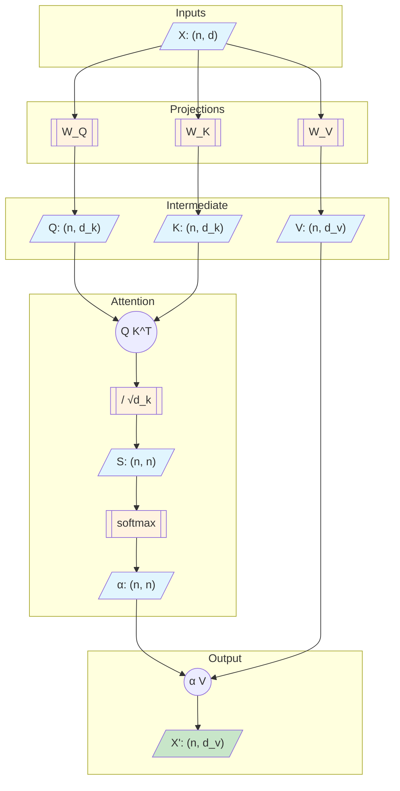
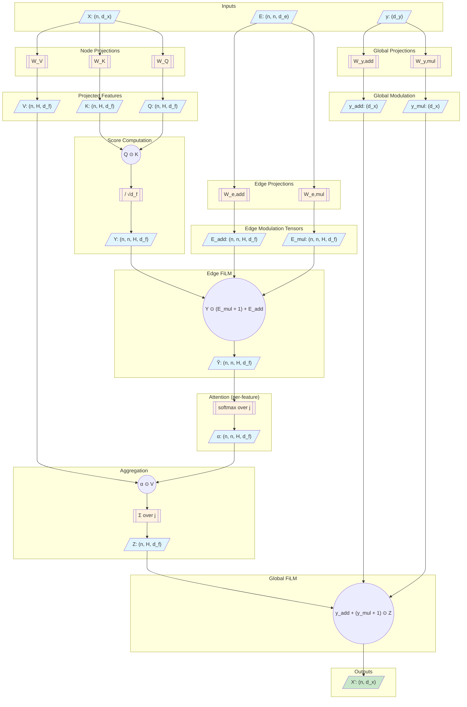
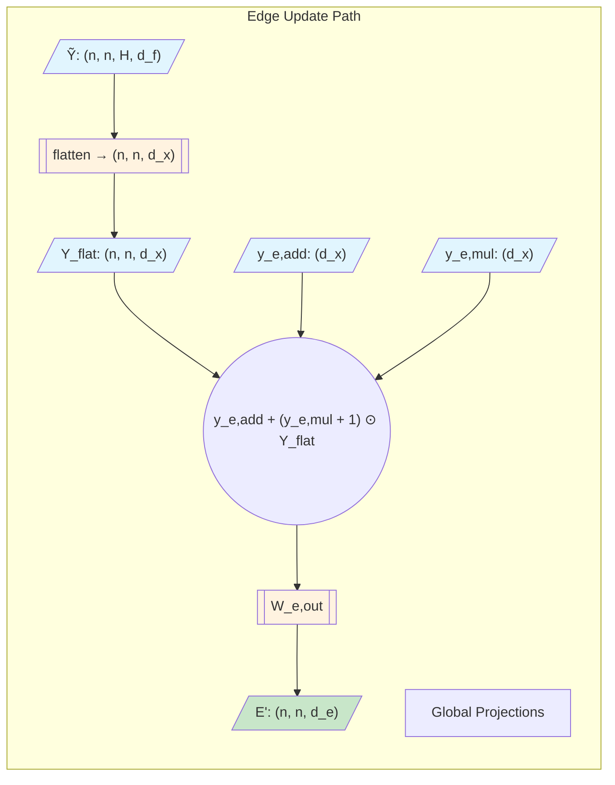

# Attention Mechanisms: DiGress vs Standard Graph Transformer

This document compares the attention mechanisms used in DiGress (Vignac et al., 2023) with standard scaled dot-product attention as used in the original Transformer (Vaswani et al., 2017) and Graph Transformer architectures.

## Overview

The fundamental difference lies in how queries and keys are combined:

| Mechanism | Q-K Combination | Attention Shape | Edge Conditioning |
|-----------|-----------------|-----------------|-------------------|
| Standard  | $\mathbf{q}^\top \mathbf{k}$ (dot product → scalar) | $\alpha \in \mathbb{R}^{n \times n}$ | None or additive |
| DiGress   | $\mathbf{q} \odot \mathbf{k}$ (element-wise → vector) | $\alpha \in \mathbb{R}^{n \times n \times d_f}$ | FiLM (mult + add) |

---

## Standard Scaled Dot-Product Attention

### Mathematical Formulation

For a single head $h$, given node features $\mathbf{X} \in \mathbb{R}^{n \times d}$:

**Projections:**
$$
\mathbf{Q} = \mathbf{X} W_Q, \quad \mathbf{K} = \mathbf{X} W_K, \quad \mathbf{V} = \mathbf{X} W_V
$$

**Attention scores** (scalar per edge):
$$
s_{ij} = \frac{\mathbf{q}_i^\top \mathbf{k}_j}{\sqrt{d_k}}
$$

**Attention weights:**
$$
\alpha_{ij} = \frac{\exp(s_{ij})}{\sum_{j'} \exp(s_{ij'})}
$$

**Output:**
$$
\mathbf{x}'_i = \sum_j \alpha_{ij} \mathbf{v}_j
$$

### Dataflow Diagram

---

## DiGress Attention (NodeEdgeBlock)

DiGress departs from standard attention in three ways:

1. **Element-wise Q⊙K** instead of dot product, yielding a vector of scores per edge
2. **FiLM conditioning** with edge features before softmax
3. **FiLM conditioning** with global features after aggregation

### Mathematical Formulation

Given node features $\mathbf{X} \in \mathbb{R}^{n \times d_x}$, edge features $\mathbf{E} \in \mathbb{R}^{n \times n \times d_e}$, and global features $\mathbf{y} \in \mathbb{R}^{d_y}$:

#### Step 1: Projections

$$
\mathbf{Q} = \mathbf{X} W_Q, \quad \mathbf{K} = \mathbf{X} W_K, \quad \mathbf{V} = \mathbf{X} W_V
$$

Reshape to $(n, H, d_f)$ where $d_x = H \cdot d_f$.

#### Step 2: Element-wise Score Tensor

$$
Y_{ij} = \frac{\mathbf{q}_i \odot \mathbf{k}_j}{\sqrt{d_f}} \in \mathbb{R}^{d_f}
$$

This produces a **vector** of $d_f$ scores per edge, not a scalar.

#### Step 3: Edge FiLM Modulation

Edge features modulate attention scores via learned projections:

$$
\mathbf{e}_{ij}^{\text{mul}} = W_{\text{e,mul}} \mathbf{E}_{ij}, \quad \mathbf{e}_{ij}^{\text{add}} = W_{\text{e,add}} \mathbf{E}_{ij}
$$

$$
\tilde{Y}_{ij} = Y_{ij} \odot (\mathbf{e}_{ij}^{\text{mul}} + \mathbf{1}) + \mathbf{e}_{ij}^{\text{add}}
$$

#### Step 4: Per-Feature Softmax

Softmax is applied over source nodes $j$, **independently for each feature dimension** $d$:

$$
\alpha_{ijd} = \frac{\exp(\tilde{Y}_{ijd})}{\sum_{j'} \exp(\tilde{Y}_{ij'd})}
$$

This yields $d_f$ separate attention patterns per head.

#### Step 5: Element-wise Aggregation

$$
\mathbf{z}_i = \sum_j \boldsymbol{\alpha}_{ij} \odot \mathbf{v}_j \in \mathbb{R}^{d_f}
$$

#### Step 6: Global FiLM Modulation

$$
\mathbf{y}^{\text{mul}} = W_{y,\text{mul}} \mathbf{y}, \quad \mathbf{y}^{\text{add}} = W_{y,\text{add}} \mathbf{y}
$$

$$
\mathbf{x}'_i = \mathbf{y}^{\text{add}} + (\mathbf{y}^{\text{mul}} + \mathbf{1}) \odot \mathbf{z}_i
$$

### Dataflow Diagram

---

## Edge Feature Update in DiGress

DiGress also updates edge features each layer. The pre-softmax score tensor $\tilde{Y}$ becomes the new edge representation after global conditioning:

---

## Complexity Comparison

| Aspect | Standard Attention | DiGress |
|--------|-------------------|---------|
| Attention weights | $O(n^2)$ per head | $O(n^2 \cdot d_f)$ per head |
| Memory for scores | $O(n^2 H)$ | $O(n^2 H d_f)$ |
| Edge feature params | 0 | $O(d_e \cdot d_x)$ for FiLM |
| Global feature params | 0 | $O(d_y \cdot d_x)$ for FiLM |

The DiGress attention is $d_f \times$ more expensive in memory but enables richer edge-conditioned attention patterns where different feature dimensions can attend differently.

---

## Code Reference

The DiGress implementation in this codebase is in `src/tmgg/models/digress/transformer_model.py`:

- `NodeEdgeBlock` (lines 162-319): Core attention + edge update logic
- `XEyTransformerLayer` (lines 49-159): Full layer with FFN and residuals
- `_GraphTransformer` (lines 322-509): Stacked layers with I/O MLPs

The standard attention implementation is in `src/tmgg/models/layers/mha_layer.py`:

- `MultiHeadAttention`: Standard scaled dot-product attention

---

## References

- Vaswani, A., et al. (2017). "Attention Is All You Need." NeurIPS.
- Vignac, C., et al. (2023). "DiGress: Discrete Denoising Diffusion for Graph Generation." ICLR.
- Dwivedi, V. P., & Bresson, X. (2020). "A Generalization of Transformer Networks to Graphs." arXiv:2012.09699.
