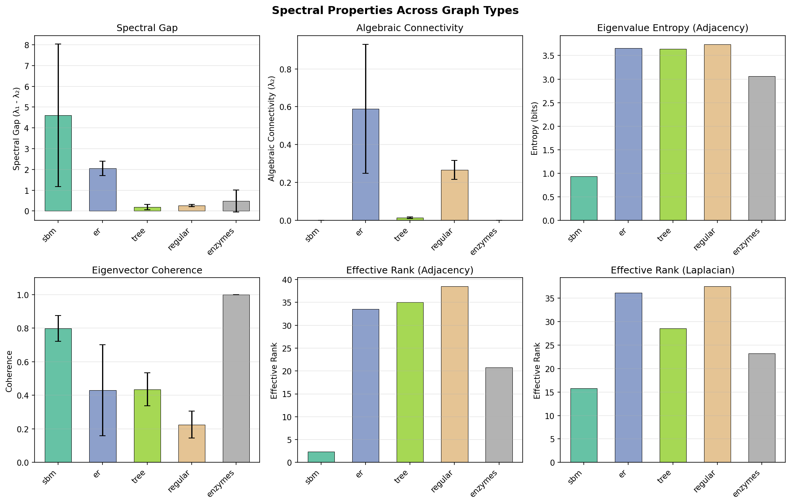
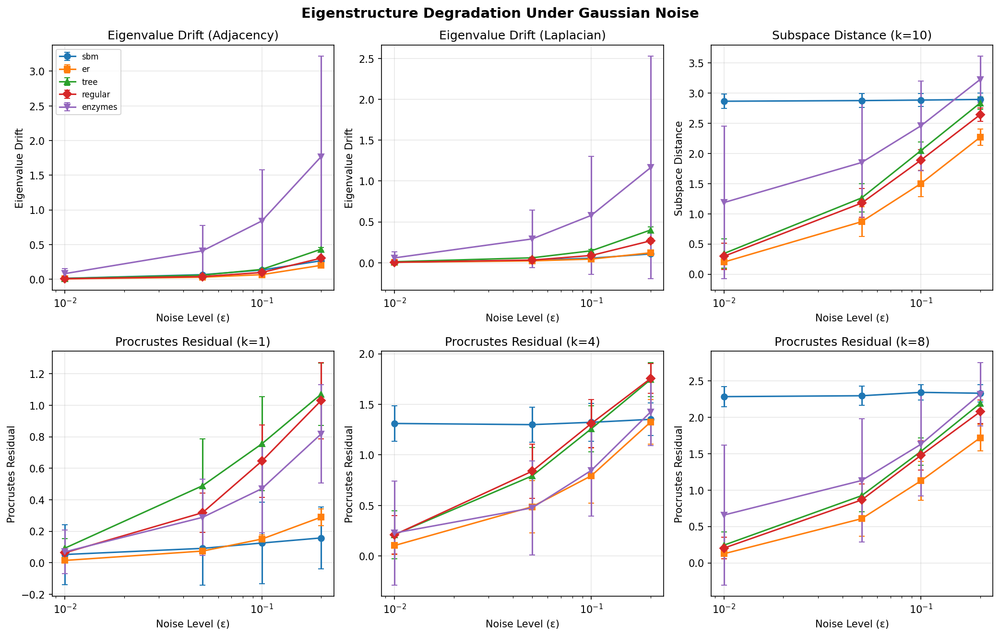
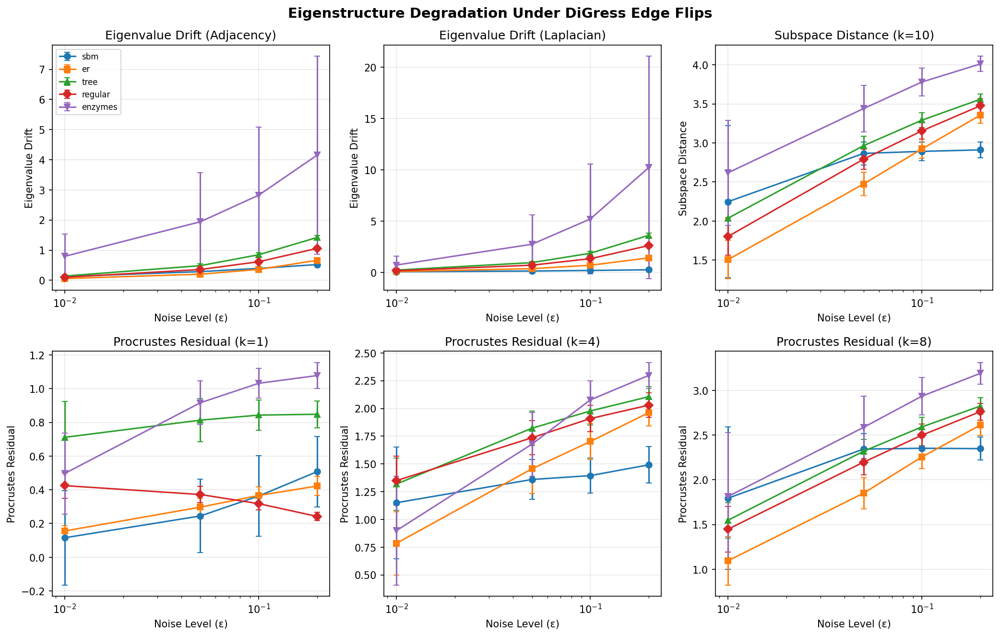
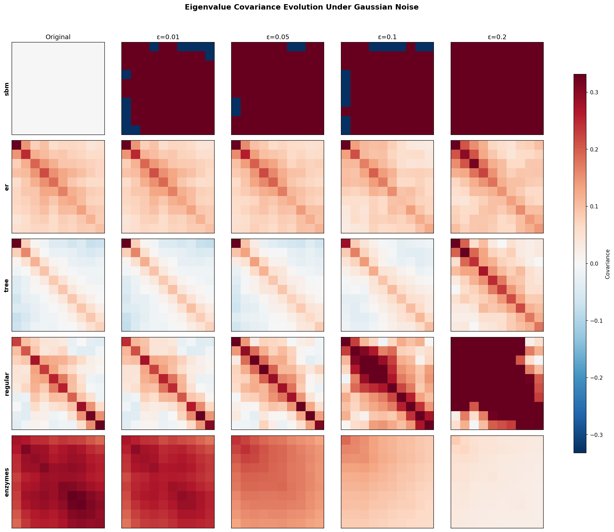
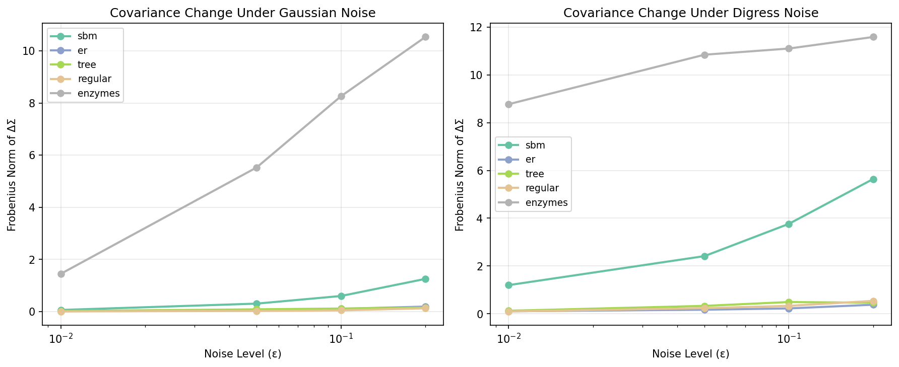

# Eigenstructure Study Report

This report summarizes the eigenstructure properties of graphs used in our diffusion experiments, examining how spectral characteristics vary across graph types and degrade under noise.

## Overview

We analyzed five graph datasets commonly used in graph generation experiments:

| Dataset | Type | Configuration | # Graphs |
|---------|------|---------------|----------|
| SBM | Stochastic Block Model | 20 nodes, 2-4 blocks, p_intra=1.0, q_inter=0.0 | 100 |
| ER | Erdős-Rényi | 50 nodes, p=0.1 | 100 |
| Tree | Random Spanning Trees | 50 nodes | 100 |
| Regular | 3-Regular | 50 nodes, d=3 | 100 |
| Enzymes | Protein Graphs (PyG) | Variable size | 100 |

Each dataset was subjected to two noise types at levels ε ∈ {0.01, 0.05, 0.1, 0.2}:
- **Gaussian**: Additive noise to edge weights
- **DiGress**: Edge flip probability (discrete perturbation)

## Spectral Properties

The spectral properties reveal fundamental differences in graph structure:

**Spectral Gap (λ₁ - λ₂)**: The SBM dataset exhibits the highest spectral gap (mean 4.6), reflecting its clear block structure. The ER graphs show moderate gaps (2.05), while trees and regular graphs have much smaller gaps (0.18 and 0.27 respectively), indicating a flatter eigenvalue distribution.

**Algebraic Connectivity (λ₂ of Laplacian)**: Regular and ER graphs show meaningful connectivity (0.27 and 0.59), while SBM and enzymes have near-zero connectivity due to their disconnected block or multi-component structure. Trees have low but positive connectivity (0.014) due to their minimal edge count.

**Eigenvector Coherence**: Enzymes show perfect coherence (1.0), suggesting degenerate eigenspaces. SBM graphs are highly coherent (0.80), while regular graphs are least coherent (0.23), indicating more distributed eigenvector structure.

**Effective Rank**: Regular and tree graphs have the highest effective rank (~35-38), meaning their spectral energy is spread across many eigenvalues. SBM graphs have very low effective rank (2.4), concentrating spectral information in few dimensions—consistent with their block structure.

## Noise Robustness

### Gaussian Noise

Under Gaussian perturbation, eigenvalue drift scales roughly linearly with noise magnitude. Regular graphs prove most robust: at ε=0.2, their adjacency eigenvalue drift (0.30) remains an order of magnitude below trees (1.77) and enzymes (1.77). This stability stems from the rigid degree constraints in regular graphs, which buffer against small weight perturbations.

Subspace distance grows more slowly for regular graphs, reaching only 2.64 at ε=0.2 compared to 3.22-3.56 for other datasets. The Procrustes residuals confirm this pattern: regular graphs maintain eigenvector alignment better than less structured graph families.

### DiGress Noise

DiGress noise (edge flips) produces more severe disruption than Gaussian noise at equivalent levels. This is expected: flipping edges changes graph topology discretely, whereas Gaussian noise merely perturbs existing weights.

Key observations:
- Eigenvalue drift under DiGress is 3-10× higher than Gaussian at the same ε
- Trees are particularly vulnerable, with eigenvalue drift reaching 3.6 at ε=0.2
- Regular graphs again show greatest resilience, though the advantage over other datasets shrinks compared to Gaussian noise
- Subspace distances saturate near 4.0 for most datasets at high noise, suggesting near-random eigenvector alignment

## Eigenvalue Covariance Structure

The eigenvalue covariance matrices reveal how spectral components co-vary across graphs in each dataset:

**SBM**: Near-zero covariance (Frobenius norm 10⁻¹³), as the block structure produces nearly deterministic eigenvalues.

**ER**: Moderate covariance (Frobenius norm 0.05), concentrated in the leading eigenvalues. As noise increases, covariance structure weakens and spreads.

**Tree**: Low original covariance (0.14) that increases substantially under noise, indicating that tree eigenstructure is sensitive to perturbation.

**Regular**: Lowest non-trivial covariance (0.05), maintaining structure even under noise—another indicator of spectral stability.

**Enzymes**: Highest covariance (11.79), reflecting the diversity of protein graph structures. The covariance changes relatively little under noise, suggesting the inter-graph variability dominates any noise-induced effects.

The Frobenius norm of covariance change confirms that DiGress causes larger structural changes than Gaussian noise for all datasets. Regular graphs show the most gradual covariance evolution under Gaussian noise.

## Summary

| Dataset | Spectral Gap | Algebraic Conn. | Robustness (Gaussian) | Robustness (DiGress) |
|---------|--------------|-----------------|----------------------|---------------------|
| SBM | High (4.6) | ~0 | Moderate | Moderate |
| ER | Moderate (2.1) | Moderate (0.59) | Moderate | Low |
| Tree | Low (0.18) | Low (0.01) | Low | Very Low |
| Regular | Low (0.27) | Moderate (0.27) | High | Moderate |
| Enzymes | Moderate (0.48) | ~0 | Moderate | Moderate |

The key findings:

1. **Regular graphs are spectrally stable**: Their constrained structure (fixed degree) limits how much noise can affect eigenvalues and eigenvectors.

2. **Trees are most vulnerable**: Minimal connectivity means any edge perturbation (especially flips) drastically alters the spectral signature.

3. **DiGress noise is harsher than Gaussian**: Discrete topological changes (edge flips) disrupt eigenstructure more than continuous weight perturbations.

4. **Block structure (SBM) provides moderate protection**: The clear separation between blocks means noise within blocks has limited spectral effect.

5. **High spectral gap does not imply robustness**: SBM has the highest spectral gap but only moderate noise robustness, while regular graphs have small spectral gaps but high robustness.

These findings inform noise schedule design for graph diffusion: datasets with fragile eigenstructure (trees, ER) may benefit from gentler noise schedules, while robust datasets (regular) can tolerate more aggressive perturbation.
