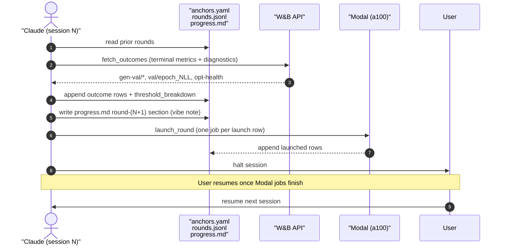
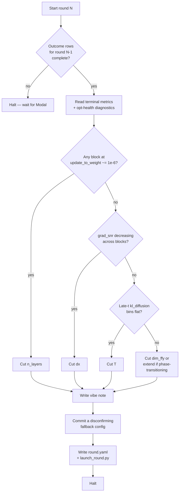
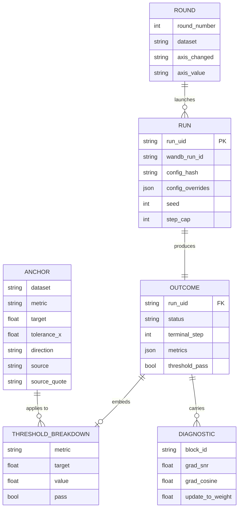
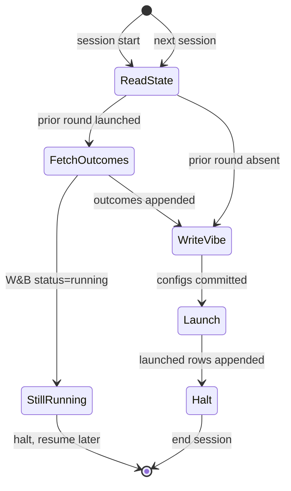

# Smallest-config search — methodology

**Date:** 2026-04-29
**Branch:** `igork/cheap-progress-telemetry`
**Companion artefacts:** `anchors.yaml`, `s_star.yaml`, `rounds.jsonl`, `progress.md`, `skill-feedback.md` (this directory).
**Companion spec/plan:** `docs/superpowers/specs/2026-04-29-smallest-config-search-design.md`, `docs/superpowers/plans/2026-04-29-smallest-config-search.md`.
**Companion skill:** `~/300_custom_tooling/399_custom_ai_skills/plugins/tmgg-research-loops/skills/smallest-config-search/SKILL.md`.

This document is the standalone methodology reference. A reviewer who reads only this file should understand what we are doing, why, with what artefacts, and against which published anchors.

## 1. Motivation and problem statement

### 1.1 The two questions

The research-frugality questions from the pre-runner methodology [1] decompose into two coupled-but-separate problems.

**Q1 — smallest-configuration question.** Given a published-numbers quality threshold $Q^*$, find the configuration $\theta$ with smallest compute footprint $C(\theta)$ that still passes. The configuration vector is

$$\theta = (d_x,\; n_{\text{layers}},\; d_{\text{ff}_y},\; T,\; S),$$

with $d_x$ the transformer hidden dim, $n_{\text{layers}}$ the depth, $d_{\text{ff}_y}$ the global-feature feed-forward width, $T$ the discrete diffusion timestep count, and $S$ the training step cap.

**Q2 — earliest-stopping question.** Given a fixed $\theta$, find the smallest $S$ at which the validation-time quality has saturated. We treat this as a one-time post-processing of a long reference run rather than a per-config online stopping rule, because the reference run already exists and the per-config online cost would dwarf the savings.

### 1.2 Quality floor (option B) over architecture-discrimination (option A)

The pre-runner [1] outlines three options for $Q^*$: a reference target (single-number anchor), a relative target ("within $X\%$ of full config"), and a distributional AND-of-metrics target. We pick the third because the v1 long-run shows the failure mode the pre-runner warns about: $\text{val/epoch\_NLL} \approx 3000\text{--}5000$ at apparent saturation while $\text{gen-val/sbm\_accuracy} \approx 0.5$ (chance) [1]. NLL alone is not sufficient — a model can match marginal degree statistics without recovering block structure. Architecture-discrimination ("does panel A separate panel B at config $\theta$?") is also rejected: it would tell us the smallest config that *separates models from each other*, not the smallest config that produces *defensibly good graphs*. Reviewer-defensibility requires the latter.

### 1.3 The optimisation problem

Formally, we solve

$$\theta^\star \;=\; \mathop{\mathrm{argmin}}_{\theta \in \Theta}\; C(\theta) \quad\text{subject to}\quad Q(\theta) \succeq Q^\star,$$

where $\Theta$ is the discrete grid over the five axes, $C(\theta) \propto d_x^2 \cdot n_{\text{layers}} \cdot T \cdot S$ is the dominant compute proxy (parameter count is quadratic in $d_x$, linear in depth; per-step FLOPs scale similarly; total FLOPs multiply through $S$; sampling cost adds another factor of $T$), and $Q(\theta)$ is a vector of validation metrics compared component-wise against the threshold vector $Q^\star$ via the strict-AND rule of §2. The order $\succeq$ is *strict* component-wise rather than weighted-sum so that no metric can compensate for another, which is what "reviewer-defensible quality floor" means.

## 2. Datasets and quality anchors

### 2.1 Two datasets

| Dataset | Hydra group | Node count | Source |
|---|---|---|---|
| SPECTRE SBM | `data=spectre_sbm` | $n \in [44, 187]$, 200 graphs | SPECTRE [9] |
| PyG ENZYMES | `data=pyg_enzymes` | $n \approx 30$, biochemical | PyG; HiGen [3] reproduces DiGress on it |

These two are the published-anchor pair: DiGress [2] reports SBM directly; HiGen [3] reports both.

### 2.2 Threshold metrics

Pinned in `anchors.yaml`:

| Dataset | degree | clustering | orbit | spectral | sbm-acc | modularity |
|---|---|---|---|---|---|---|
| SPECTRE SBM | $\le 0.0013$ | $\le 0.0498$ | $\le 0.0433$ | $\le 0.01$ | $\ge 0.8$ | $\ge 0.3$ |
| PyG ENZYMES | $\le 0.004$ | $\le 0.083$ | $\le 0.002$ | (path D) | n/a | n/a |

The first three SBM rows (degree/clustering/orbit) come from HiGen Table 1; spectral is a conservative ceiling because neither paper reports DiGress's spectral on SBM, and HiGen's own SBM spectral is $0.0046$, so $0.01$ is loose enough to absorb reproduction noise. The accuracy and modularity targets are spec defaults: $0.8$ rounds up DiGress's reported $0.74$ V.U.N. number; $0.3$ is a structural-quality continuous proxy for the binary `sbm_accuracy`.

### 2.3 The DiGress paper reports MMD-ratios, not raw MMD

The reconciliation note in `anchors.yaml` (lines 7–16) records the unit mismatch verbatim. Quote from DiGress Appendix F.1:

> "We do not report raw numbers but ratios computed as follows: $r = \mathrm{MMD}(\text{generated}, \text{test})^2 / \mathrm{MMD}(\text{training}, \text{test})^2$."

DiGress Table 1's SBM row reads "DiGress 1.6 1.5 1.7 74%". These three numbers are *ratios* $r$, not raw MMD. The `tmgg` evaluation pipeline emits raw MMD. HiGen Table 1 reports raw MMD (degree $0.0013$, clustering $0.0498$, orbit $0.0433$), which match our pipeline's units. We therefore anchor on HiGen's raw MMD numbers for the SBM dataset, with the DiGress paper's V.U.N. ($74\% \to 80\%$ rounded up) for `sbm_accuracy`. Failing to reconcile this would mean comparing $r=1.6$ (a ratio) against an absolute target of $0.0013$ (an MMD), an apples-to-oranges error.

For ENZYMES, DiGress did not evaluate on ENZYMES at all — its general-graph experiments cover only SBM, planar, and Community-20. HiGen reproduces DiGress on ENZYMES; HiGen is therefore the sole anchor.

### 2.4 The strict-AND threshold rule

A run with metric vector $\mathbf{m} = (m_1, \ldots, m_k)$ passes iff every metric component passes its own threshold. With $t_i$ the per-metric target, $\tau_i$ the per-metric tolerance, and $\mathrm{dir}_i$ the direction, this is

$$\mathrm{pass}(\mathbf{m}) \;=\; \bigwedge_{i=1}^{k} \begin{cases} m_i \le t_i \cdot \tau_i & \text{if } \mathrm{dir}_i = \text{smaller-is-better}\\[4pt] m_i \ge t_i & \text{if } \mathrm{dir}_i = \text{larger-is-better} \end{cases}$$

Default $\tau_i = 1.5$ for the four MMD metrics (the standard 50% slack our pipeline reproductions need to absorb). $\tau_i = 1.0$ (no slack) for `sbm_accuracy`, `modularity_q`, and the conservative spectral ceiling. The conjunction is strict so that no metric can compensate for another.

The function is implemented in `scripts/sweep/check_threshold.py` as `check_run(metrics, dataset, anchors_path) -> breakdown`. It refuses to load an `anchors.yaml` missing entries for any (dataset, metric) tuple referenced in `rounds.jsonl`, and refuses to declare a pass when any required metric key is missing — both per the loud-failure invariants of §7.

## 3. The decision loop — vibes-augmented coordinate descent

### 3.1 Vibes vs formal

| Layer | Concern | Encoded by |
|---|---|---|
| **Vibes** | Which axis to attack next; how aggressively to shrink; which diagnostic to trust when they disagree; whether to extend a phase-transition-y run instead of cutting it; whether literature suggests an axis is contested. | Prose vibe note in `progress.md`, written by Claude using accumulated ML prior plus the previous round's W&B telemetry plus opt-health diagnostics. |
| **Formal** | Threshold definitions; `rounds.jsonl` schema; run-naming convention; round-section scaffold; strict-AND-with-tolerance rule; disconfirming-config requirement; loud-failure invariants. | Encoded in scripts and the SKILL.md scaffold; scripts raise loudly on violation. |

The point of the split is that the vibe note can choose poorly *but cannot quietly let a failing config through*: `check_threshold.py` enforces the strict-AND rule mechanically, and `fetch_outcomes.py` refuses to write `threshold_pass=true` if any required metric is missing. The vibe layer can only steer the search direction, not relax the success criterion.

### 3.2 Why coordinate descent, not Hyperband, BO, or random grid

The pre-runner [1] outlines three textbook alternatives. Each is rejected for reasons specific to this regime.

**Naive grid over 7 axes × 3 levels = 2187 runs.** Disqualifying on cost alone.

**Random search [5].** Random search is the standard workhorse and dominates grid search whenever the effective dimensionality is much smaller than the nominal dimensionality. We reject it here because we already have *axis-pre-rank* information: the v1 long-run's `train/weight_norm` trajectories per transformer block tell us which axes have slack. Bergstra and Bengio's argument is most compelling when no such prior exists; we have one.

**Hyperband [4].** Hyperband halts the bottom half of a population by an early-fidelity proxy, reallocates to survivors, repeats. It is excellent when the early-fidelity proxy correlates with the final ranking. In this regime it does not: the v1 long-run shows step-wise *phase transitions* where `gen-val/sbm_accuracy` is flat at chance for tens of thousands of steps and then jumps. Hyperband would kill exactly the configs that are about to phase-transition. The same critique applies to Successive Halving and to BOHB. Hyperband's reported speedups [4] come from settings where loss curves are *monotone* and decision-relevant variation appears early; phase-transition-heavy curves violate that assumption.

**Gaussian-process Bayesian Optimisation [6].** GP-BO is the gold standard for low-dimensional continuous spaces with smooth objective surfaces. Our objective is the strict-AND boolean over six metrics, and our axes are discrete with strong domain priors. GP-BO would also need many full-budget runs ($\ge 30$) to fit a useful surrogate. The cost is wrong for our context.

**LLM-as-optimizer with formal scaffolding.** Claude reads the previous round's metrics, opt-health diagnostics, sample images; writes a vibe note interpreting what the data says; commits to the next config. The scaffolding (`anchors.yaml`, `rounds.jsonl`, the round-section scaffold, the disconfirming-config requirement) provides the formal layer that GP-BO would otherwise need to provide. The LLM provides the *prior* — accumulated literature recall, intuitions about which diagnostics matter when — that a 30-run GP would otherwise need to reconstruct from scratch.

### 3.3 The round body

### 3.4 Per-round decision logic

The flowchart is the *default* logic. The vibe note can override it whenever literature or prior-round evidence suggests a different cut order. The override is recorded in prose and audited by the synthesis subsection of every round (§6).

## 4. Step-budget $S^\star$ derivation

### 4.1 Saturating-exponential model

Domhan et al. [7] propose extrapolating learning curves with a parametric mixture of saturating functional forms (exponential, power, logarithmic) to predict whether a run is worth continuing. The simplest member of that family — and the only one we use here — is the three-parameter saturating exponential

$$f(s) \;=\; a \cdot \left(1 - e^{-s/\tau}\right) + c,$$

with $a$ the asymptotic gain, $\tau$ the time constant, and $c$ the offset. The closed-form step at which the curve reaches fraction $\alpha \in (0, 1)$ of its asymptotic gain is

$$s_\alpha \;=\; -\tau \ln(1 - \alpha).$$

For $\alpha \in \{0.90, 0.95, 0.99\}$ this gives $s_{0.90} = \tau \ln 10 \approx 2.30 \tau$, $s_{0.95} \approx 3.00 \tau$, $s_{0.99} \approx 4.61 \tau$. The latest of those across metrics is the sweep's universal step cap $S^\star$.

### 4.2 Why this functional form

Three properties make it the right first-cut prior. It is **monotone** in $s$ (no oscillation), **bounded** above by $a + c$ (so terminal-value extrapolation is well-defined), and **asymptotically constant** (so $s_\alpha$ exists for every $\alpha < 1$). And it is parsimonious — three parameters fit cleanly from $\sim 10$ sample points without overfitting noise. Domhan's full mixture [7] adds power-law and logarithmic terms to capture early-time concavity that the saturating exponential misses; we do not need that fidelity for a cap-setting decision.

### 4.3 Degraded-data outcome — the dual-key schema

Computing $S^\star$ on the v1 long-run revealed a sampling-cadence problem. The v1 run logs `val/gen/*` only three times across $232\text{k}$ steps, because the generation-eval is expensive. Three points is below the `MIN_POINTS_FOR_FIT = 8` threshold of `compute_s_star.py`. The structural-quality $S^\star$ — which is what actually governs the sweep — is unreached.

`val/epoch_NLL` does have $\sim 46$ samples, but its trajectory is nearly flat with `std/mean ≈ 0.19`; the saturating-exponential fit returns $\tau < 0$, $a < 0$ (degenerate), and $s_{0.95} \approx -142\text{k}$ (negative, meaningless). The script writes `nll_fit_status: degenerate-fit-nll-too-noisy` and refuses to use the fit.

The fallback is a **dual-key schema** in `s_star.yaml`:

- `s_star: null` — refusing to silently confuse an NLL upper bound with a structural-quality $S^\star$.
- `s_star_operational: 100000` — the step cap the sweep actually uses, chosen by the human reviewer. Independent of any fit.
- `s_star_nll_upper_bound: null` (currently — degenerate fit) — would be the sign-flipped `val/epoch_NLL` saturation step when fittable.
- `s_star_nll_caveat`, `sanity_check`, `gen_val_sample_counts` — multi-line caveats and per-metric sample-count diagnostics so the under-sampling is visible at a glance.

Per the pre-runner's "Pitfall to design around" section, NLL plateaus do not always match sample-quality plateaus in this regime; the NLL-derived $S^\star$ would be only an *upper bound* even if it fitted cleanly. The structural-quality $S^\star$ replaces the operational cap once a v1-equivalent run with `eval_every_n_steps ≤ 10000` lands.

The script raises `InsufficientSamplesError` (a `KeyError` subclass) per metric and accumulates; if zero gen-val/* metrics meet the floor and `--nll-fallback` is *not* passed, it aborts loudly per the CLAUDE.md "fail loud" rule.

## 5. Anchors and the paper-vs-reproduction gap

### 5.1 The unit gap, again

§2.3 establishes that DiGress reports MMD-ratios while our pipeline emits raw MMD. The downstream consequence: the *paper* anchor cannot be used directly for SBM degree/clustering/orbit; the *reproduction* anchor (HiGen [3]) is the operational source. We invert the usual paper-over-reproduction priority because the unit-mismatch makes the paper number incomparable, not because we trust HiGen more in general. The anchors.yaml entries record this verbatim under each metric's `note:` field so a reviewer can audit the choice.

### 5.2 MMD on graph statistics — provenance

The MMD-on-degree/clustering/orbit/spectral evaluation protocol was established by GraphRNN [8] (You et al., ICML 2018). They introduced "a benchmark suite of datasets, baselines and novel evaluation metrics based on Maximum Mean Discrepancy (MMD), which measure distances between sets of graphs." GRAN [10] (Liao et al., NeurIPS 2019) extended the protocol and refined the implementation; subsequent work — including SPECTRE [9], DiGress [2], and HiGen [3] — uses the GraphRNN/GRAN MMD definitions. Our pipeline emits raw MMD in the GraphRNN/GRAN convention, which is why HiGen's raw MMD numbers are directly comparable.

The MMD-on-graph-statistic protocol has well-known pitfalls — kernel bandwidth choice can flip rankings, the squared-MMD is positive but not bounded, and reproductions that change the sampler can move numbers by 50% without changing model quality — which is precisely why the strict-AND rule uses a $1.5\times$ tolerance on MMD metrics rather than zero slack.

## 6. Operational artefacts and audit trail

### 6.1 The five files

| File | Role | Mutability |
|---|---|---|
| `anchors.yaml` | Pinned thresholds + provenance per (dataset, metric). | Edited only on paper-number correction; outcomes are then re-checked over `rounds.jsonl`. |
| `s_star.yaml` | Step cap (operational + NLL-upper-bound dual-key). | Recomputed when a denser-cadence reference run lands. |
| `rounds.jsonl` | Append-only launch and outcome rows. One JSON object per line. | Append-only. |
| `progress.md` | Append-only prose log. One section per round. | Append-only. |
| `skill-feedback.md` | Append-only running log of skill deviations. | Append-only; drives Phase 4 SKILL.md edits. |

### 6.2 ER-style relationships

### 6.3 Append-only invariant and reconstruction rule

`rounds.jsonl` is append-only: a launch row is written when Modal accepts the job, an outcome row is appended later when W&B finalises. The latest state of run $R$ is the most recent row matching `run_uid == R`. Append-only preserves the full audit trail; failed runs leave their launch rows in place with a paired `status: failed` outcome row and a `failure_kind` field. Re-running `check_threshold.py` after an `anchors.yaml` edit produces *new* outcome rows superseding old ones; nothing is rewritten in place.

The `run_uid` format is `smallest-cfg/<dataset>/r{round}/{axis_changed}/{config_hash[:8]}`, also passed as the W&B run name so the JSONL ↔ W&B join works on either `run_uid` or `wandb_run_id`.

### 6.4 Per-round commit cadence

Every round produces three commits: one for outcome rows (after `fetch_outcomes.py`), one for the new `progress.md` section, one for the new `launched` rows (after `launch_round.py`). The commit cadence is not an aesthetic preference: each commit is a checkpoint a future session can roll back to without losing the audit trail.

## 7. Failure modes and the loud-failure invariants

### 7.1 Failure-mode table

Reproduced from spec §7. Each mode has a deliberate non-recovering response per CLAUDE.md "fail loud, no graceful fallback".

| Failure | How it shows up | Response |
|---|---|---|
| Modal launch refused (deploy fail, secret missing) | Wrapper non-zero exit before W&B run created | Don't append a `launched` row. Halt the round. Surface output. |
| Modal SIGILL on cheap-tier (`reference_modal_avx512_sigill.md`) | W&B run exists, `status=crashed`, `exit=-4`, very few steps | Outcome row with `failure_kind="sigill"`. Next round's vibe note proposes relaunch on `GPU_TIER=fast`. Never silently retry. |
| OOM | CUDA OOM, `last_logged_step` early | `failure_kind="oom"`. Treat as lower bound on shrinkability. Lock the failed combo as off-limits. |
| Diverged / NaN loss | `val/epoch_NLL` becomes inf/NaN | `failure_kind="diverged"`. Vibe note decides re-seed vs `lr` change. |
| Run still running on session resume | `kind=launched` exists, no outcome, W&B `status=running` | `fetch_outcomes.py` skips. Wait or kill via Modal CLI if stuck > $2\times$ expected wall-time. |
| W&B summary missing a key | `KeyError` at threshold check | `check_threshold.py` raises loudly. Vibe note investigates: usually `eval_every_n_steps` didn't fire at $S^\star$ or run died before final eval. |
| Threshold paper number wrong | Caught during synthesis or by reviewer | Edit `anchors.yaml`, re-run `check_threshold.py` over `rounds.jsonl`. Audit trail preserved. |
| Two seeds disagree on threshold | Both outcomes committed; `threshold_pass` differs | Vibe flags borderline. Synthesis decides: extend to 3rd seed, or treat as failed (default conservative). |

### 7.2 The three loud-failure invariants

1. **`launch_round.py` refuses to append a `launched` row if the wrapper exited non-zero.** Hard gate. Without this invariant a Modal failure could silently produce a `launched` row that no W&B run will ever resolve, and the next session would wait forever.
2. **`fetch_outcomes.py` refuses to write `threshold_pass=true` if any required metric key is missing.** Hard gate. A missing metric is the canonical evidence that the run died before its final eval; treating it as "passed-on-the-metrics-we-do-have" would be the exact graceful-fallback antipattern CLAUDE.md prohibits.
3. **`check_threshold.py` refuses to load an `anchors.yaml` that doesn't have an entry for every (dataset, metric) tuple referenced in `rounds.jsonl`.** Hard gate. An anchor edit that drops a metric would otherwise silently skip that metric in the AND. The check forces the editor to confront the implication.

All three are hard gates rather than warnings because each closes a path by which the sweep could *appear to be making progress* while the formal layer is broken. Warning-only versions would be ignored once the sweep is in flight.

## 8. Multi-session continuity

### 8.1 Why Claude-as-optimiser, not Optuna or Ax

A standard hyperparameter-optimisation library — Optuna, Ax, Ray Tune, BoTorch — would handle the scheduling and surrogate-fitting machinery for free. Three reasons we don't use one.

**Budget.** The user's budget for this sweep is on the order of $25$–$30$ runs per dataset, *not* the $30$+ runs a GP surrogate needs to fit, plus setup time. Per the pre-runner's framing, less is more.

**Accumulated ML prior.** The LLM brings literature recall (e.g. "DiGress and GDPO disagree on $d_{\text{ff}_y}$ sensitivity") and diagnostic-interpretation intuition (e.g. "a block at `update_to_weight ≈ 1e-6` is dead → drop `n_layers` next") that a GP surrogate cannot reconstruct from the small data this budget produces. The surrogate would default to "explore everywhere" because every cell of the search space looks roughly equally promising before the first 30 fits.

**Prose-level justifications.** The sweep is reviewer-facing. A reviewer reading `progress.md` should understand *why* round 4 cut $d_x$ rather than $T$ — not just see that some surrogate's expected-improvement was higher. Optuna can produce a study object; it cannot produce the synthesis subsection that re-checks whether the trajectory still makes sense.

### 8.2 Session lifecycle

Each session is self-contained: read → optional fetch → write → optional launch → halt. The append-only artefacts are the entire shared state. There is no in-memory continuation between sessions.

### 8.3 The disconfirming-config fallback

Every round's vibe note ends with an explicit "if I'm wrong about this, here's the cheapest disconfirming config." That config becomes the *auto-fallback* if the round's chosen configs all fail. The mechanism is the safety rail on the vibe layer: if Claude is overconfidently chasing a local minimum (e.g. cutting $d_x$ when the actual bottleneck is $T$), the disconfirming config provides the cheap counter-evidence that surfaces the mistake one round later instead of five rounds later. Combined with the per-round synthesis subsection — which re-reads all prior rounds and audits whether the trajectory still makes sense — this is the formal answer to "what stops the LLM from going off the rails?"

## 9. References

[1] Pre-runner methodology: `docs/reports/2026-04-28-hp-tuning-and-knee-identification/README.md` — the methodology this document operationalises.

[2] Vignac, C., Krawczuk, I., Siraudin, A., Wang, B., Cevher, V., and Frossard, P. "DiGress: Discrete Denoising Diffusion for Graph Generation." ICLR 2023. arXiv:2209.14734. [https://arxiv.org/abs/2209.14734](https://arxiv.org/abs/2209.14734)

[3] Karami, M. "HiGen: Hierarchical Graph Generative Networks." arXiv preprint, May 2023. arXiv:2305.19337. [https://arxiv.org/abs/2305.19337](https://arxiv.org/abs/2305.19337)

[4] Li, L., Jamieson, K., DeSalvo, G., Rostamizadeh, A., and Talwalkar, A. "Hyperband: A Novel Bandit-Based Approach to Hyperparameter Optimization." *Journal of Machine Learning Research* 18(185):1–52, 2018. arXiv:1603.06560. [https://jmlr.org/papers/v18/16-558.html](https://jmlr.org/papers/v18/16-558.html) | [https://arxiv.org/abs/1603.06560](https://arxiv.org/abs/1603.06560)

[5] Bergstra, J. and Bengio, Y. "Random Search for Hyper-Parameter Optimization." *Journal of Machine Learning Research* 13:281–305, 2012. [https://jmlr.org/papers/v13/bergstra12a.html](https://jmlr.org/papers/v13/bergstra12a.html)

[6] Snoek, J., Larochelle, H., and Adams, R. P. "Practical Bayesian Optimization of Machine Learning Algorithms." *Advances in Neural Information Processing Systems* 25, NIPS 2012, pp. 2951–2959. arXiv:1206.2944. [https://arxiv.org/abs/1206.2944](https://arxiv.org/abs/1206.2944)

[7] Domhan, T., Springenberg, J. T., and Hutter, F. "Speeding up Automatic Hyperparameter Optimization of Deep Neural Networks by Extrapolation of Learning Curves." *Proceedings of IJCAI 2015*, pp. 3460–3468. [https://www.ijcai.org/Proceedings/15/Papers/487.pdf](https://www.ijcai.org/Proceedings/15/Papers/487.pdf) | [https://ml.informatik.uni-freiburg.de/wp-content/uploads/papers/15-IJCAI-Extrapolation_of_Learning_Curves.pdf](https://ml.informatik.uni-freiburg.de/wp-content/uploads/papers/15-IJCAI-Extrapolation_of_Learning_Curves.pdf)

[8] You, J., Ying, R., Ren, X., Hamilton, W. L., and Leskovec, J. "GraphRNN: Generating Realistic Graphs with Deep Auto-regressive Models." *ICML 2018*. arXiv:1802.08773. [https://arxiv.org/abs/1802.08773](https://arxiv.org/abs/1802.08773) | [https://proceedings.mlr.press/v80/you18a.html](https://proceedings.mlr.press/v80/you18a.html)

[9] Martinkus, K., Loukas, A., Perraudin, N., and Wattenhofer, R. "SPECTRE: Spectral Conditioning Helps to Overcome the Expressivity Limits of One-shot Graph Generators." *ICML 2022*, pp. 15159–15179. arXiv:2204.01613. [https://arxiv.org/abs/2204.01613](https://arxiv.org/abs/2204.01613)

[10] Liao, R., Li, Y., Song, Y., Wang, S., Hamilton, W., Duvenaud, D. K., Urtasun, R., and Zemel, R. "Efficient Graph Generation with Graph Recurrent Attention Networks." *NeurIPS 2019*. arXiv:1910.00760. [https://arxiv.org/abs/1910.00760](https://arxiv.org/abs/1910.00760)

[11] Spec: `docs/superpowers/specs/2026-04-29-smallest-config-search-design.md` (gitignored; on disk).

[12] Plan: `docs/superpowers/plans/2026-04-29-smallest-config-search.md` (gitignored; on disk).

[13] Skill: `~/300_custom_tooling/399_custom_ai_skills/plugins/tmgg-research-loops/skills/smallest-config-search/SKILL.md`.
